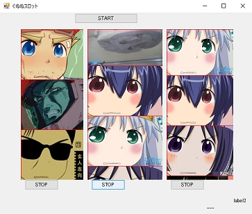
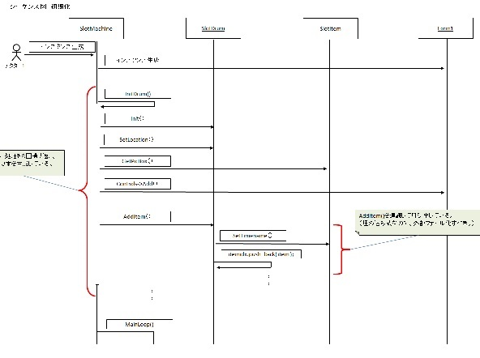

# GununuSlot
スロットマシン（一応ゲーム）です。  
ぐぬぬキャラのドラムがくるくる回って、ストップボタンでゆっくり滑らかに停止します。  
滑らかさをお楽しみください。  
  
絵柄が３つそろったら、画面右下に申し訳程度に小さく「あたり」って出ます。  
あと、止まってからもう一度ストップボタンを押すと、１コマだけ進みます。  

# 環境
・Visual C++ 2008  

作ったのは、2012年頃です。  
UML/シーケンス図も入れてあります。  
  

(2016/09)  
