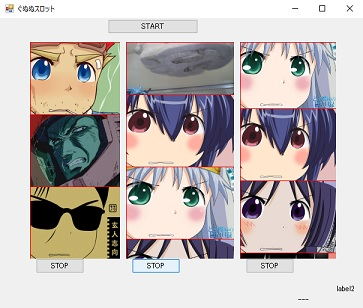
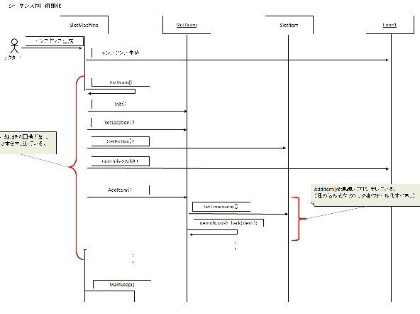

# GununuSlot

> ## 🎮 ブラウザ版（HTML5リメイク）
> 2012年頃の Visual C++ 2008（C++/CLI + Windows Forms）製スロットマシンを、**プラグイン・ビルド不要でブラウザ上で動く HTML5 / JavaScript（Canvas）** に移植しました。
> ぐぬぬ顔・ぬこのドラム画像は、原作のファイルをそのまま再利用しています。
>
> - **遊ぶ:** <https://tobisako.github.io/GununuSlot/>（リポジトリ直下の [`index.html`](./index.html) が紹介ページ、ゲーム本体は [`game.html`](./game.html)）
> - **遊び方:** START で3本のドラムが毎回ランダムな速度で回転。STOP で1本ずつ減速し、コマにぴったり整列してゆっくり滑らかに停止。中央段が3つ揃うと右下に申し訳程度に小さく「当り！！」
> - **原作仕様もそのまま:** 減速カーブ（−8→−3→−1）も、停止後にもう一度 STOP を押すと1コマだけ進む小ネタ（ソース内の呼び名は「詐欺モード」）も移植済み
> - 効果音はリメイクでの追加です（🔊ボタンでON/OFF）

スロットマシン（一応ゲーム）です。  
ぐぬぬキャラのドラムがくるくる回って、ストップボタンでゆっくり滑らかに停止します。  
滑らかさをお楽しみください。  
  
絵柄が３つそろったら、画面右下に申し訳程度に小さく「あたり」って出ます。  
あと、止まってからもう一度ストップボタンを押すと、１コマだけ進みます。  

# 環境
・Visual C++ 2008  

作ったのは、2012年頃です。  
UML/シーケンス図も入れてあります。  
  

(2016/09)  
